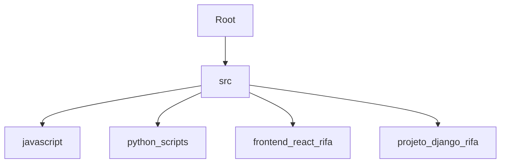

<div align="center">

  <h1>🏛️ Arquitetura do Projeto & Decisões Técnicas</h1>
  <p>
    <strong>Uma abordagem escalável, modular e moderna para resolução de problemas técnicos.</strong>
  </p>

  <p align="center">
    
    
    
    
  </p>

</div>

---

### 🧠 **Visão Geral**

Este repositório não é apenas uma coleção de scripts, mas uma demonstração de engenharia de software aplicada. O objetivo foi transformar exercícios lógicos isolados em uma estrutura de projeto coesa, separando responsabilidades e preparando o terreno para escalabilidade real.

> *"Código funcional resolve o problema de hoje. Código bem arquitetado previne os problemas de amanhã."*

---

### 📂 **Estrutura do Projeto (File System)**

A organização das pastas segue o padrão de **Separação de Preocupações (SoC)**, onde cada diretório tem uma responsabilidade clara e única.



| Diretório | Responsabilidade & Decisão Técnica |
| :--- | :--- |
| `src/javascript` | **Core Logic (Node.js)**: Soluções puras e performáticas para os algoritmos de lógica, sem dependências externas desnecessárias. |
| `src/python_scripts` | **Data Processing Logic**: Implementações alternativas em Python, demonstrando versatilidade e aptidão para lidar com manipulação de dados mais pesada se necessário. |
| `src/frontend_react_rifa` | **Client-Side (SPA)**: Aplicação **Vite + React** moderna. Utiliza components funcionais e **Tailwind CSS** para uma UI responsiva e de alta fidelidade visual. |
| `src/projeto_django_rifa` | **Backend Foundation**: Estrutura baseada em **Django**, escolhida pela robustez e segurança ("batteries-included") para uma futura persistência de dados em SQL. |

---

### 🛠️ **Deep Dive: Decisões Arquiteturais**

#### 1. **Frontend Moderno (React + Vite + Tailwind)**
Optar por **Vite** ao invés de *CRA (Create React App)* reduz o tempo de build drasticamente. O uso de **Tailwind CSS** permite um desenvolvimento *Utility-First*, resultando em um bundle de CSS final menor e uma manutenção de estilos muito mais ágil do que CSS tradicional ou SASS.
*   **Componentização**: A `RifaComponent.jsx` encapsula toda a lógica de estado (`useState`), garantindo que a regra de negócio visual esteja desacoplada do restante da aplicação.

#### 2. **Poliglotismo (JS & Python)**
Demonstrar a solução na linguagem solicitada (JS) e na linguagem de domínio pessoal (Python) prova a capacidade de adaptar a ferramenta certa para o trabalho certo. Python é ideal para a lógica de sorteio devido às suas bibliotecas matemáticas robustas, enquanto JS brilha na interatividade web.

#### 3. **Clean Code & Patterns**
Todo o código segue princípios de **KISS (Keep It Simple, Stupid)** e **DRY (Don't Repeat Yourself)**. Variáveis possuem nomes semânticos (`bilhetesVendidos`, `ultimoGanhador`) e funções têm responsabilidade única (`handleVender`, `handleSortear`).

---

### 🚀 **Próximos Passos (Roadmap)**

Para elevar este projeto a um nível Enterprise, os próximos passos seriam:

- [ ] **Dockerização**: Criar um `Dockerfile` e `docker-compose.yml` para orquestrar o Frontend e os Scripts de Backend em containers isolados.
- [ ] **CI/CD**: Configurar GitHub Actions para rodar testes automatizados a cada *Push*.
- [ ] **API Rest**: Migrar a lógica Python para uma API **FastAPI** ou **Django REST Framework**, consumida pelo Frontend React.

---

<div align="center">
  <sub>Documentação gerada com rigor técnico por <strong>Dev Pamela M.S</strong></sub>
</div>

---

## 🛡️ Qualidade e Testes (QA)

Para garantir a robustez da aplicação, implementei uma suíte de testes automatizados cobrindo cenários críticos e bordas (Edge Cases). A estratégia de testes foca no "Caminho Feliz" (Happy Path) e tentativas de violação de regras de negócio.

### 🧪 Javascript (Jest)
Testes unitários focados na **regras de negócio do Singleton** e **Concorrência**:
*   ✅ **Validação de Compra:** Garante que vendas válidas sejam registradas.
*   🚫 **Prevenção de Duplicidade:** Simula condições de corrida para impedir venda dupla.
*   🎲 **Integridade do Sorteio:** Verifica se o ganhador é válido e da lista correta.
*   ⚠️ **Fail Fast:** Validações de limites (números negativos, fora do range).

### 🐍 Python (Pytest)
Testes de **Lógica de Backend** e **Segurança**:
*   🔒 **Type Safety:** Validação dos contratos de dados via Dataclasses.
*   🔐 **CSPRNG Verification:** Garante que o sorteio utiliza a entropia segura.
*   🛡️ **Imutabilidade:** Testes de borda para garantir que a Rifa não aceita modificações após fechada.

### Como rodar os testes
```bash
# Frontend & Core Logic (JS)
npx jest

# Backend Logic (Python)
python -m pytest
```
